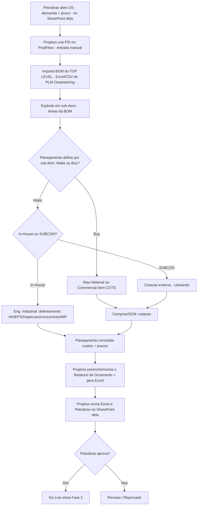
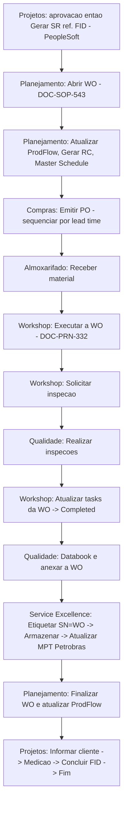
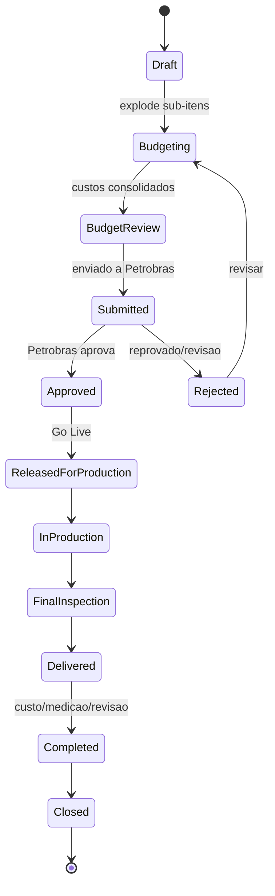
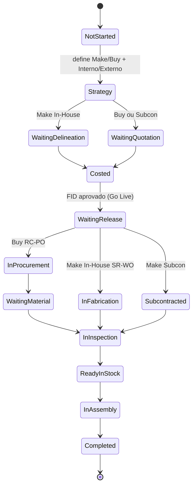
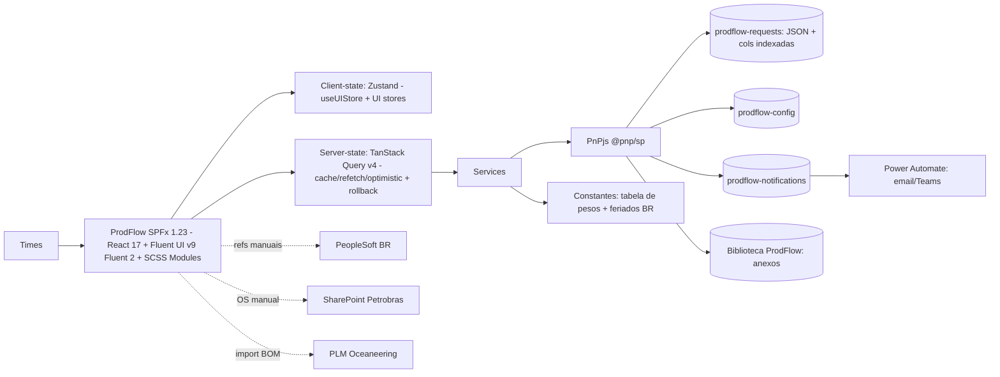

# ProdFlow — CIDEQ Production Management System

### Plano de Projeto & Especificação Técnica (documento autocontido para bootstrap)

> **Propósito deste documento:** reunir TODO o planejamento, contexto de negócio, fluxos, modelo de dados, status, arquitetura, design e roadmap para **iniciar o projeto do zero em uma nova sessão/workspace**, independente do SmartFlow/SmartBid. É autocontido — quem ler não precisa de contexto adicional.
>
> **Status:** Planejamento revisado após a **reunião de 2026-08-28 com a gerência (Pedro Fernandes · Laura · Raphael)**. Pronto para execução (Fase 0).
> **Data:** 2026-08-28 · **Autor do plano:** time CIDEQ (Oceaneering Brasil) + assistência de IA.
>
> **Decisões de nomenclatura (fechadas na reunião):**
>
> - **Nome do app:** **ProdFlow** (_production / product flow_). Descartado "ForgeFlow" ("forge" = forjado, gera confusão).
> - **ID rastreável:** **FID — Fabrication ID** (fala-se "fid"), formato `FID0000001`. **Não** é `PID` (Houston) nem `FRID`.
> - **Reuso do SmartBid 2.0:** o ProdFlow **porta e adapta** blocos já comprovados do SmartBid — stores **Zustand** + **`useUIStore`**, componentes **`MembersManagement`** e **`SystemConfiguration`**, o kit de UI (`GlassCard` / `KPICard` / `DataTable` / badges), o **`bomParser`** (import de BOM) e o padrão de **página dedicada por entidade** (`BidDetailPage` → **`FidDetailPage`**). Charts em **Nivo** (visual polido, _themed_ pelos mesmos design tokens). É outro app / outro SharePoint, mas com o mesmo DNA visual e de estado.

---

## 1. Sumário Executivo

O **ProdFlow** é um novo aplicativo **SPFx (SharePoint Framework, React + TypeScript)**, criado **do zero**, para gerir o ciclo completo de **fabricação sob demanda** do projeto **CIDEQ** (Oceaneering Brasil, cliente **Petrobras**). O sistema cobre **duas fases** sob um mesmo identificador **FID (Fabrication ID)**:

1. **Fase 1 — Orçamentação (fase crítica):** receber a **OS da Petrobras**, **importar a BOM** do desenho **TOP LEVEL** (gerado pela **engenharia da Oceaneering** e já liberado no **PLM**), definir a estratégia **make/buy** por sub-item (decisão do **Planejamento / PCP**), levantar custos (materiais, HH, serviços), consolidar e **enviar o orçamento à Petrobras**; aguardar aprovação. **É a fase que “dá nó” hoje** — por isso todo o detalhamento é puxado para a orçamentação.
2. **Fase 2 — Fabricação & Montagem (acompanhamento):** após aprovação (**Go Live**), a fase 2 é majoritariamente **acompanhamento de status** da manufatura — compras, fabricação (interna/externa), qualidade, almoxarifado, serialização, montagem, entrega e **medição** (faturamento) — com **datas e nº de WO referenciados do PeopleSoft**.

**Por que existe:** Houston usa o módulo de **manufatura** do ERP **PeopleSoft** (gera o **PID**). O Brasil usa um módulo de **manutenção** adaptado para fabricar e **não tem** um ID de produto próprio — o ProdFlow preenche essa lacuna criando o **FID** e orquestrando o processo. O **PeopleSoft Brasil** (o _Financial_ encerra em fevereiro; o futuro é **Oracle**) cuida de procurement/financeiro (SR/RC/PO/WO), cujos números são **referenciados manualmente** no ProdFlow.

**Substitui hoje:** uma planilha Excel gigante (~40 colunas), um Kanban confuso (cards com paredões de texto) e um Excel manual de orçamento — tudo controlado à mão pelo time de Projetos.

---

## 2. Contexto de Negócio

- **Cliente:** Petrobras. **Contratada:** Oceaneering (OII). **Projeto:** CIDEQ (ex.: "Lote A"). **Contrato** de exemplo: `4600684130`.
- **Uso:** exclusivo **Brasil**. Idioma primário **pt-BR** (com en como secundário).
- A Petrobras abre uma **OS** (Ordem de Serviço) no **SharePoint dela** ("Controle de Ordens de Serviço") com prazo de atendimento. O time de Projetos da Oceaneering **cria o FID no ProdFlow a partir dessa OS** (entrada manual — tenants distintos, sem integração).
- O **desenho TOP LEVEL** e a **BOM** são gerados pela **engenharia da Oceaneering** (já liberados no **PLM**) — o ProdFlow **não cria desenho de engenharia**. A BOM é **importada do PLM** (Excel/CSV) para dentro do FID.
- **Cada produto = 1 FID.** O FID é explodido em **sub-itens (linhas da BOM / PNs)**, cada um com sua estratégia make/buy e rastreio próprios. **Sub-item NÃO gera FID/OF próprio.** Produtos distintos (ex.: "garrafa" e "celular") = **FIDs separados**, nunca combinados num mesmo top level.
- **Sistema separado** do SmartFlow (que é só do almoxarifado e vive no site SM Global controlado pelo TI): o ProdFlow tem **SharePoint próprio**, com **integração opcional futura** ao SmartFlow em pontos como almoxarifado.

---

## 3. Identidade do Produto

| Item                        | Valor                                                                                                                                                                                                          |
| --------------------------- | -------------------------------------------------------------------------------------------------------------------------------------------------------------------------------------------------------------- |
| **Nome**                    | **ProdFlow** (curto: "Prod")                                                                                                                                                                                   |
| **Subtítulo**               | _CIDEQ Production Management System_                                                                                                                                                                           |
| **ID rastreável**           | **FID — Fabrication ID** (fala-se "fid"), formato `FID0000001` (7 dígitos, sequencial)                                                                                                                         |
| **Identificador em código** | `fabricationId` / `fid`                                                                                                                                                                                        |
| **Plataforma**              | SPFx **1.23** (toolchain Heft) · **React 17.0.1** (teto do SPFx) · **TypeScript 5.8** · **Node 22** · **Fluent UI v9 / Fluent 2** + SCSS Modules · Zustand · PnPjs v3 · **Nivo** (charts) — tenant Oceaneering |
| **Estética**                | Identidade **Oceaneering** (**azul/navy + neutros**), **minimalista, pouca cor** (cor reservada a status) + **glassmorphism & liquid glass** herdados do SmartBid 2.0                                          |

---

## 4. Atores / Times / Papéis

| Time                                | Fase 1 | Fase 2 | Responsabilidades principais                                                                                                                                    |
| ----------------------------------- | :----: | :----: | --------------------------------------------------------------------------------------------------------------------------------------------------------------- |
| **Projetos**                        |   ✅   |   ✅   | Cria FID a partir da OS; consolida e envia orçamento à Petrobras; registra aprovação; Go Live; gera SR (ref. PeopleSoft); informa cliente; medição; conclui FID |
| **Planejamento / PCP**              |   ✅   |   ✅   | **Decide make/buy + interno/externo por sub-item**; compila custos; preenche a máscara de orçamento; abre WO; gera RC; Master Schedule; finaliza WO             |
| **Engenharia Industrial (interna)** |   ✅   |   ✅   | **Delineamento** de fabricação (HH, EPS, inspeções, consumíveis, MP) para itens In-House — com **controle de revisão**                                          |
| **Compras / SCM**                   |   ✅   |   ✅   | Cotações (Fase 1); emite RC→PO; **sequencia pedidos por lead time**; follow-up de fornecedores                                                                  |
| **Workshop**                        |   —    |   ✅   | Executa a WO (usinagem, marcação); atualiza tasks; conclui WO                                                                                                   |
| **Qualidade**                       |   —    |   ✅   | Inspeções (MP, solda, final), END/NDT, NCR, databook                                                                                                            |
| **Almoxarifado**                    |   —    |   ✅   | Recebe, armazena e entrega material                                                                                                                             |
| **Service Excellence**              |   —    |   ✅   | Serialização (SN = nº da WO), armazenagem, atualização do **MPT** Petrobras                                                                                     |
| **Admin / Manager**                 |   ✅   |   ✅   | Configuração, membros, tabela de preços, indicadores                                                                                                            |

> **Correção da reunião:** a definição **make/buy e interno/externo é do Planejamento (PCP)** — **a Petrobras NÃO define** se o item é feito dentro ou fora (contratualmente não pode); ela quer celeridade, mas a decisão é técnica/produtiva da Oceaneering.
> **Pendente de confirmação:** detalhamento fino do papel do Service Excellence além de serialização/MPT.

---

## 5. Glossário

| Sigla / Termo                 | Significado                                                                                                                                                          |
| ----------------------------- | -------------------------------------------------------------------------------------------------------------------------------------------------------------------- |
| **FID**                       | Fabrication ID (ID do ProdFlow; fala-se "fid") — 1 por produto/OS                                                                                                    |
| **OS / OM**                   | Ordem de Serviço / Ordem de Manutenção (Petrobras)                                                                                                                   |
| **TOP LEVEL**                 | Desenho principal **gerado pela engenharia da Oceaneering** (liberado no PLM). **Não vem da Petrobras**                                                              |
| **BOM**                       | _Bill of Materials_ — lista de materiais do TOP LEVEL, **importada do PLM** (Excel/CSV) para o FID                                                                   |
| **PLM**                       | _Product Lifecycle Management_ — onde a engenharia libera desenho + BOM                                                                                              |
| **SUB-LEVEL / sub-item / PN** | Linhas da BOM que compõem o TOP LEVEL (Part Numbers). **Não geram FID/OF próprio**                                                                                   |
| **CRD**                       | Desenho de referência do cliente (ex.: `DE-3000.00-1521-600-PEH-1321_D01`)                                                                                           |
| **Make / Buy**                | Estratégia por sub-item (decidida pelo **Planejamento**): fabricar ou comprar                                                                                        |
| **In-House / SUBCON**         | Fabricação interna (Oceaneering/Workshop) ou externa (subcontratada)                                                                                                 |
| **Raw Material / COTS**       | Matéria-prima ou item comercial (Commercial Off-The-Shelf)                                                                                                           |
| **Usinando**                  | Fornecedor externo (usinagem/fabricação subcontratada)                                                                                                               |
| **OII**                       | Oceaneering International Inc.                                                                                                                                       |
| **SR → WO**                   | Service Request → Work Order (caminho Make/interno, no PeopleSoft)                                                                                                   |
| **RC → PO**                   | Requisição de Compra → Purchase Order (caminho Buy/externo, no PeopleSoft)                                                                                           |
| **NF**                        | Nota Fiscal                                                                                                                                                          |
| **HH**                        | Homem-hora                                                                                                                                                           |
| **EPS**                       | Especificação de Procedimento de Soldagem                                                                                                                            |
| **END / NDT (LP/PM)**         | Ensaios Não Destrutivos (Líquido Penetrante / Partícula Magnética)                                                                                                   |
| **NCR**                       | Non-Conformance Report                                                                                                                                               |
| **Databook**                  | Dossiê de qualidade/fabricação anexado à WO                                                                                                                          |
| **Delineamento**              | Documento de fabricação in-house (máquina, tempo de máquina, HH) — hoje Word do Favorette; no ProdFlow vira **formulário com controle de revisão** + export PDF/Word |
| **Master Schedule**           | Cronograma do programador (Adriano) das atividades do workshop; a **WO alimenta as datas** do FID                                                                    |
| **MPT**                       | Processo Petrobras de material (atualizado pelo Service Excellence, via SharePoint OII)                                                                              |
| **Medição**                   | Marco de faturamento junto à Petrobras                                                                                                                               |
| **Multa 30%**                 | **Indicador** de exposição a multa por atraso (30% do Orçamento Oceaneering) — não é multa aplicada                                                                  |
| **DOC/RSO**                   | Referência de documento (`DOC 31.2026` / `RSO 26.2026`) — **significado exato a confirmar**                                                                          |
| **PeopleSoft (PS Brasil)**    | ERP de procurement/financeiro do Brasil (gera SR/RC/PO/WO). O _Financial_ encerra em fev; futuro = **Oracle**                                                        |
| **PID**                       | Production ID (equivalente de Houston no PeopleSoft; NÃO usado no Brasil)                                                                                            |

---

## 6. Sistemas Externos & Fronteiras de Integração

| Sistema                                     | Papel                                        | Integração                                                                                         |
| ------------------------------------------- | -------------------------------------------- | -------------------------------------------------------------------------------------------------- |
| **SharePoint Petrobras** ("Controle de OS") | Origem da **demanda** (OS + prazo)           | **Manual** (Projetos digita no ProdFlow)                                                           |
| **PLM Oceaneering**                         | Origem do **TOP LEVEL + BOM** (engenharia)   | **Import Excel/CSV** da BOM para o FID (sem copiar/colar item a item)                              |
| **PeopleSoft Brasil**                       | Gera/gerencia SR, RC, PO, WO                 | **Referência manual**; **futuro:** leitura SQL _read-only_ p/ auto-preencher datas (ticket aberto) |
| **SharePoint OII**                          | Atualização do MPT (Service Excellence)      | Manual / link                                                                                      |
| **SmartFlow (almoxarifado)**                | Recebimento/estoque no fluxo do almoxarifado | **Integração opcional futura** (touchpoint de almoxarifado)                                        |
| **Power Automate**                          | Notificações (e-mail/Teams)                  | Via lista de gatilho `prodflow-notifications`                                                      |

> **Regra de ouro:** o ProdFlow **orquestra e rastreia**; ele **não substitui** o PeopleSoft nem integra (hoje) com a Petrobras. Os números SR/RC/PO/WO são campos referenciados (como já são hoje as colunas "RC ou SR" / "PO ou WO" da planilha).
> **Nota (reunião):** abriu-se um ticket (via Sheila → time da Índia) para **acesso de leitura em tempo real ao PeopleSoft Brasil** (RC/WO). Se aprovado, digitar um nº de referência **puxa datas de entrega/finalização automaticamente**, reduzindo input manual. Há ainda a possibilidade futura de cruzar a **query de estoque da Oceaneering** (30k+ itens com PN) para checar disponibilidade/ponto de ressuprimento — **escopo CIDEQ** por ora.

---

## 7. Fluxo Ponta a Ponta

### 7.1 Fase 1 — Orçamentação



**Regras da Fase 1:**

- A Petrobras **descreve a complexidade** (Usinagem e Caldeiraria/Soldagem) na OS e pode indicar uma **preferência** de atendimento — mas **quem decide make/buy e Interno × Externo é o Planejamento (PCP)**, por sub-item (contratualmente a Petrobras **não** define isso).
- **Import da BOM (PLM):** a BOM do TOP LEVEL é importada (Excel/CSV) e **cada linha recebe uma estratégia obrigatória** (dropdown travado: `Buy · Raw Material` · `Buy · Commercial Items` · `Make · In-House` · `Make · SUBCON`) — não pode ficar em branco.
- O orçamento = **dias para fabricar + dias para comprar/chegar COTS + dias para montagem**, mais custo (HH + materiais + subcon).
- Na Fase 1 é obrigatório **acompanhar o andamento de cada sub-item** individualmente.
- _(opcional)_ **Assistente de decisão make/buy** para orientar o planejador quando a estratégia não estiver clara (ideia da reunião — a definição nem sempre é óbvia para quem executa).

### 7.2 Fase 2 — Fabricação & Montagem (WO-cêntrica)



- **Fase 2 é majoritariamente acompanhamento de status** (a fase crítica é a orçamentação). O ProdFlow **espelha** o estágio da manufatura e **referencia** SR/RC/PO/WO do PeopleSoft.
- **Buy** segue `RC → PO → recebimento`; **Make/In-House** segue `SR → WO → execução → inspeção → databook`; **SUBCON** vai ao fornecedor externo. Todos convergem em inspeção → estoque → montagem → entrega.
- **Delineamento** (in-house) é **anexado à SR** e exportado do sistema para o Workshop.
- **Sequenciamento por lead time:** o planejador dispara primeiro o item de maior prazo e, dias depois, os de menor prazo — para os componentes **convergirem na montagem** (evita item parado/perdido no estoque).
- **Datas vindas da WO:** o FID **puxa a data de entrega da Work Order** (hoje entrada manual; futuro: leitura automática do PeopleSoft Brasil — ver §6).
- **SN do item = nº da WO** (rastreabilidade).
- Fecho: finalizar WO, informar cliente, **medição** e concluir o FID.

### 7.3 Kanban atual (referência — NÃO copiar)

Colunas de hoje: `EM COTAÇÃO · AGUARDANDO INÍCIO · EM FABRICAÇÃO · EM COMPRAS · QUALIDADE · CONCLUÍDO`. Cards são paredões de texto digitados à mão. **Objetivo do ProdFlow: substituir por cards estruturados + timeline com autor/data.**

---

### 7.4 Roteiro por sub-item (cada sub-item, um caminho — times diferentes)

Na **Fase 1**, o **Planejamento é quem mais atua**: ele **delineia cada sub-item** e define o **roteiro (routing)** que ele seguirá. Como a estratégia (make/buy · interno/externo) varia por sub-item, **cada sub-item percorre um caminho diferente no processo — e a cada etapa um time diferente atua**. Isso deve ser exibido de forma **clara, profissional e limpa**: um _pathway_ por sub-item, com o **time responsável** em cada passo.

Roteiros por estratégia (etapa → **time**):

- **Buy · Matéria-prima:** Estratégia → **Planejamento** · Cotação → **SCM** · RC/PO → **Compras** · Recebimento → **Almoxarifado** · Inspeção → **Qualidade** · Estoque → **Almoxarifado**
- **Buy · Item comercial (COTS):** Estratégia → **Planejamento** · Cotação → **SCM** · RC/PO → **Compras** · Recebimento → **Almoxarifado** · Estoque → **Almoxarifado**
- **Make · In-House:** Estratégia → **Planejamento** · Delineamento → **Eng. Industrial** · Abertura de WO → **Planejamento** · Fabricação → **Workshop** · Inspeção/Databook → **Qualidade** · Serialização/MPT → **Service Excellence**
- **Make · SUBCON:** Estratégia → **Planejamento** · Cotação → **SCM** · RC/PO → **Compras** · Fabricação externa → **Usinando** · Inspeção → **Qualidade** · Recebimento → **Almoxarifado**

**No sistema:** cada sub-item mostra seu **roteiro como um pathway horizontal** (passos conectados), com **badge do time responsável** por passo, o **passo atual destacado** e os concluídos marcados; uma **legenda de times** (cores discretas) mantém a leitura limpa. O roteiro é **derivado automaticamente** da estratégia definida pelo Planejamento.

---

### 7.5 Import & Mapeamento da BOM (PLM / Windchill)

A BOM do TOP LEVEL é **exportada do PLM (Windchill) em CSV/XLSX** e **importada** no FID — sem digitação. O mapeamento reaproveita o **`bomParser` do SmartBid** (usado na página _BOM Costs_): a mesma mecânica de leitura e de montagem da árvore (o **design é próprio do ProdFlow** — só a lógica de mapeamento é reusada).

**Colunas que importam:** **`Level`**, **`Name`** (→ Part Number), **`Qty`**, **`Description`** (+ **`Revision`** e **`F/N`** quando existem). As demais colunas do export (State, Phase, Type, Unit Of Measure…) são opcionais/ignoradas.

**Regras de parsing (do `bomParser`):**

- **Limpeza Windchill:** part numbers vêm como `="0662354"` (trava o auto-formato do Excel) → remover o wrapper `="..."`.
- **Header dinâmico:** localizar a linha de cabeçalho procurando as colunas `Level` + `Name` (o export tem título e linhas em branco antes do header).
- **Hierarquia pela coluna `Level`:** lista **plana** em que o **pai de cada linha é o último item de `Level-1`** (algoritmo de **pilha por nível**; ao subir para um nível mais raso, limpar os níveis mais profundos). Gera `parentId`; a **árvore é derivada em memória**.
- **Rollups bottom-up:** custo/prazo/progresso agregam do nível mais profundo até o `Level 1` (TOP LEVEL = FID).
- **UI em árvore:** indentação `(level − 1) × 20px`, expandir/recolher, rótulo `nível.F/N` (padrão da _BOM Costs_).

**Exemplo real (CSV anexo `0662354 rev B`):** `0662354` RISER PROTECTION SLEEVE (**L1** = FID) → `0657413` FIXED CLAMP … ASSEMBLY (**L2**) → `0522404-M8` NUT, `0657396` ARM, `0651688` SPINDLE … (**L3**) → `0340373-1` ROPE WIRE (**L4**) → `0535119` ROPE WIRE 316SS (**L5**). São **5 níveis** — e cada linha, ao ser importada, **recebe a estratégia make/buy obrigatória** (dropdown travado) para o Planejamento delinear.

---

## 8. OS da Petrobras — Campos de Origem (entrada manual)

Campos do formulário "Controle de Ordens de Serviço" que Projetos transcreve para o FID:

| Campo Petrobras                  | Exemplo                            | Destino no FID                                                     |
| -------------------------------- | ---------------------------------- | ------------------------------------------------------------------ |
| OS ou OM                         | `6000786587`                       | `osNumber`                                                         |
| Descrição Resumida               | "Ferramenta de manuseio de Choke…" | `descricao`                                                        |
| Entregável                       | "Projeto CRD: DE-3000…-1321_D01"   | `drawing.code` + escopo                                            |
| Tipo de Orçamento                | `Fabricação`                       | `tipoOrcamento`                                                    |
| **Usinagem**                     | `Média`                            | `complexidadeUsinagem` (Baixa/Média/Alta/N/A/A definir)            |
| **Caldeiraria/Soldagem**         | `Média`                            | `complexidadeCaldeiraria` (mesmo conjunto)                         |
| **Atendimento Fabricação**       | `Interna`                          | `atendimentoPreferido` (preferência Petrobras, **não vinculante**) |
| Comentários                      | —                                  | `comentarios`                                                      |
| Status Aprovação                 | `Orçamento Solicitado`             | espelho do status Petrobras                                        |
| Prazo dias corridos / Data Prazo | —                                  | `dates.prazoDiasCorridos`                                          |
| Attachments                      | `DE-…_D01.pdf`                     | anexo (biblioteca ProdFlow)                                        |

**Regra de complexidade:** guardar **as duas** (Usinagem + Caldeiraria) e derivar **`complexidadeGeral = a maior`** (usada no cálculo de SLA). **Make/buy e Interno/Externo são decididos pelo Planejamento por sub-item** — o campo `atendimentoPreferido` da OS é, no máximo, uma **preferência não vinculante** da Petrobras.

---

## 9. Relatório de Orçamento de Fabricação (máscara + geração de Excel)

Hoje Projetos preenche um Excel manual e anexa no SharePoint da Petrobras. **No ProdFlow isso vira uma máscara**, preenchida por **Planejamento + Eng. Industrial**, e **Projetos apenas baixa o Excel** (branding Oceaneering + Petrobras) para enviar.

**Regra de preenchimento:** o usuário edita **APENAS `QTD` / `Quantidade (HH)`**. A coluna **`Peso` é FIXA** (constante do contrato, no código); **`Peso Total` e `Valor` são automáticos**.

**Cabeçalho:** Cliente (Petrobras), Contrato, OS, Projeto, Desenho, N° do orçamento, Data Envio, Assinatura Contratada, Assinatura Petrobras.

**Tabela 1 — Serviços adicionais** (colunas: Serviço, Critério, QTD, Peso, Peso Total)

- Inspeção LP/PM & certificações (HH), Revestimentos metálicos (UN), Revestimentos não-metálicos (UN), Pintura (M²), Magnetização de peças (UN).

**Tabela 2 — Matéria prima** (colunas: Categoria, Descrição, UN, QTD, Peso, Peso Total)

- Categorias: **Aço Carbono, Aço Inox, Cobre, Alumínio, Polímeros** (lista de especificações por categoria — ver Apêndice A).
- **+ Usinagem/Caldeiraria/Engenharia de Fabricação** (colunas: Serviço, Complexidade, Quantidade (HH), Peso, Peso Total).

**Tabela 3 — Aquisição de partes e peças (COTS)** (colunas: Categoria, Valor, Obs)

**Valor Final:** soma dos "Peso Total" (T1+T2+T3) × preço unitário do contrato → **TOTAL R$** (exemplo real: **R$ 100.028,19**). Inclui **Entrega (dias corridos)**, **Observações** e assinaturas.

> **Mapeamento make/buy ↔ tabelas:** Raw Material = T2 (matéria prima); COTS = T3 (partes e peças); Make (labor) = T2 (usinagem/caldeiraria/eng) + T1 (serviços adicionais).

---

## 10. SLA & Prazos

Existem **dois prazos distintos** (não confundir):

### 10.1 SLA de resposta do orçamento (meta interna — apresentar orçamento à Petrobras)

Por **complexidade** × **local** (dias **úteis**):

| Complexidade | Interno (na base) | Externo (fora da base) |
| ------------ | :---------------: | :--------------------: |
| Baixa        |         1         |           5            |
| Média        |         3         |           10           |
| Alta         |         5         |           15           |

- **`Prazo (Dias Úteis)` é derivado** de `complexidadeGeral` × `atendimento` (do sub-item).
- **`Prazo para envio à Petrobras` = `Solicitação de Orçamento` + Prazo(dias úteis)** → o sistema marca **`Atrasado`** automaticamente se `Data de envio > Prazo`.
- **Cálculo de dias úteis DEVE considerar feriados brasileiros** (calendário configurável) — senão o prazo sai errado.

### 10.2 Prazo de entrega da fabricação (cotado no orçamento)

Em **dias corridos** (ex.: **45**), atrelado à **data de aprovação**. Sujeito à fila de prioridades e à análise de **carga × capacidade produtiva**.

---

## 11. Modelo de Dados

**Estratégia de persistência (decidida):** **UMA lista** `prodflow-requests`, **um item por FID**, com **JSON completo** (cabeçalho + sub-itens aninhados + orçamento + financeiro + histórico). Padrão comprovado do SmartFlow/SmartBid (`jsondata`). **Sem** lista separada de sub-itens (evita coordenação entre listas).

Para permitir filtro/consulta por status/fase sem carregar tudo, **promover ~5 colunas indexadas** no SharePoint: `FID`, `OS`, `Fase`, `Status`, `Ano`. O restante fica no JSON, e **board/planner/Gantt/dashboard por sub-item** são montados **expandindo os sub-itens em memória** (client-side).

### 11.1 Interfaces TypeScript (esboço para bootstrap)

```typescript
type Complexity = "Baixa" | "Média" | "Alta" | "N/A" | "A definir";
type Attendance = "Interna" | "Externa"; // na base / fora da base
type Strategy = "Make" | "Buy";
type BuyType = "RawMaterial" | "CommercialItem"; // COTS
type MakeSite = "InHouse" | "Subcon";

type RequestStatus =
  | "Draft"
  | "Budgeting"
  | "BudgetReview"
  | "Submitted"
  | "Approved"
  | "Rejected"
  | "ReleasedForProduction"
  | "InProduction"
  | "FinalInspection"
  | "Delivered"
  | "Completed"
  | "Closed"
  | "OnHold"
  | "Cancelled";

type SubItemStatus =
  // Fase 1
  | "NotStarted"
  | "Strategy"
  | "WaitingDelineation"
  | "WaitingQuotation"
  | "Costed"
  // Fase 2
  | "WaitingRelease"
  | "InProcurement"
  | "WaitingMaterial"
  | "InFabrication"
  | "Subcontracted"
  | "InInspection"
  | "ReadyInStock"
  | "InAssembly"
  | "Completed"
  | "OnHold"
  | "Cancelled";

interface IDrawing {
  code: string;
  revision: string;
} // controle de revisão (D01, D02...)

interface IDelineation {
  // Make/In-House (Eng. Industrial) — formulário com CONTROLE DE REVISÃO + export PDF/Word
  hh: number;
  eps?: string;
  inspections?: string[];
  consumables?: string;
  rawMaterial?: string;
  notes?: string;
  revision: string; // Rev A, B... — só editor autorizado altera
  revisionHistory?: { rev: string; by: string; date: string; note?: string }[];
  printableUrl?: string; // PDF/Word gerado p/ o líder do workshop (prefere papel)
  checklist: IChecklistStep[]; // desenho -> HH -> EPS/inspecoes -> custo fechado
}

interface IQuotation {
  // Buy / SUBCON (Compras)
  supplier: string;
  value: number;
  leadTimeDays: number;
  obs?: string;
}

interface IMaterialCert {
  heatLot: string;
  spec: string;
  certUrl?: string;
} // rastreabilidade

interface IChecklistStep {
  key: string;
  label: string;
  done: boolean;
  date?: string;
  by?: string;
}

interface ISubItem {
  id: string;
  // Hierarquia da BOM (padrão bomParser do SmartBid): LISTA PLANA + level/parentId.
  // "children" é DERIVADO em memória p/ render em árvore — a fonte da verdade é level + parentId.
  level: number; // 1 = TOP LEVEL (produto/FID); 2,3,4,5... = componentes/sub-componentes
  parentId?: string | null; // pai = último item de (level-1) na ordem da BOM
  children?: ISubItem[]; // derivado (não persistido como fonte)
  findNumber?: string; // F/N — sequência dentro do pai (coluna da BOM)
  pn: string; // = coluna "Name" da BOM (Part Number)
  pnBr?: string;
  qtd: number; // = coluna "Qty"
  unit?: string; // EA/FT... (Unit Of Measure)
  descricao: string; // = coluna "Description"
  drawing: IDrawing; // revision = coluna "Revision"
  qualityCode?: string; // vem da BOM do PLM
  strategy: Strategy; // OBRIGATÓRIO — dropdown travado (4 opções: buy raw/commercial · make in-house/subcon)
  buyType?: BuyType;
  makeSite?: MakeSite;
  attendance: Attendance; // default do FID, editável por sub-item
  complexity: Complexity;
  status: SubItemStatus;
  delineation?: IDelineation;
  quotation?: IQuotation;
  // Fase 2 — referências do PeopleSoft (manuais)
  rcOrSr?: string;
  poOrWo?: string;
  prazoFabricacaoDias?: number;
  dataInicioFab?: string;
  dataFimFab?: string;
  dataTerminoReal?: string;
  fabChecklist: IChecklistStep[]; // MP->usinagem->marcacao->revestimento->pintura->inspecao->montagem->entrega
  serialNumber?: string; // = nº da WO
  certificates?: IMaterialCert[];
  docRso?: string; // DOC/RSO (significado a confirmar)
  servico?: string; // ex.: "Usinagem/Soldagem"
  simultaneidade?: { flag: boolean; withLines?: string[] };
  // financeiro por sub-item
  orcamentoUsinando?: number;
  partesEPecas?: number;
  servicos?: number;
  custoTotal?: number;
  orcamentoOceaneering?: number;
  receita?: number;
}

interface IBudget {
  // máscara do Relatório de Orçamento
  contrato: string;
  numeroOrcamento: string;
  dataEnvio?: string;
  tabela1: IBudgetLine[]; // serviços adicionais
  tabela2Materiais: IBudgetLine[]; // matéria prima
  tabela2Labor: IBudgetLine[]; // usinagem/caldeiraria/engenharia (HH)
  tabela3: { categoria: string; valor: number; obs?: string }[];
  entregaDiasCorridos?: number;
  observacoes?: string;
  totalValor: number;
}
interface IBudgetLine {
  categoria?: string;
  descricao: string;
  criterio?: "HH" | "UN" | "M2" | "KG";
  complexidade?: Complexity;
  qtd: number;
  peso: number;
  pesoTotal: number; // pesoTotal = qtd*peso (auto)
}

interface IFinancials {
  custoTotal: number; // = orcamentoUsinando + partesEPecas + servicos
  orcamentoOceaneering: number; // valor cobrado da Petrobras
  receita: number; // = orcamentoOceaneering - custoTotal (margem)
  multaExposicao30: number; // indicador = 0.30 * orcamentoOceaneering (se em atraso)
}

interface IHistoryEvent {
  ts: string;
  by: string;
  type: string;
  message: string;
}

interface IFabricationRequest {
  fid: string; // FID0000001
  osNumber: string;
  osType?: "OS" | "OM";
  projeto: string;
  lote?: string;
  drawing: IDrawing;
  descricao: string;
  tipoOrcamento: string;
  complexidadeUsinagem: Complexity;
  complexidadeCaldeiraria: Complexity;
  complexidadeGeral: Complexity;
  atendimento: Attendance;
  phase: 1 | 2;
  status: RequestStatus;
  dates: {
    recebimentoDemanda?: string;
    solicitacaoOrcamento?: string;
    prazoEnvioPetrobras?: string;
    retornoOrcamento?: string;
    dataEnvioPetrobras?: string;
    dataAprovacaoPetrobras?: string;
    prazoDiasUteis?: number;
    prazoDiasCorridos?: number;
  };
  budget: IBudget;
  financials: IFinancials;
  subItems: ISubItem[];
  approval?: { by: string; date: string; signatureRef?: string };
  medicao?: { milestone: string; status: string; date?: string };
  semanaTermino?: string;
  mesPrevisto?: string;
  history: IHistoryEvent[];
  attachments: { name: string; url: string; kind: string }[];
}
```

> **Sub-itens = linhas da BOM, NÃO geram FID/OF próprio (decisão da reunião).** Só o **produto (TOP LEVEL, Level 1) tem FID**. A BOM é **multi-nível** e vem do PLM (Windchill) — modelada como **lista plana com `level` + `parentId`** (padrão do `bomParser` do SmartBid), com a **árvore derivada em memória** para render (indentação por nível, expande/recolhe). Os **rollups** (custo, receita, progresso, status) **agregam de baixo para cima** (do nível mais profundo ao topo); o nó pai é derivado dos filhos e o orçamento do FID considera as **folhas**. Produtos distintos = **FIDs separados** (nunca combinados num mesmo top level). Detalhes do import/mapeamento em **§7.5**.

### 11.2 Mapeamento com a planilha de controle atual (~40 colunas)

| Bloco         | Colunas da planilha                                                                                                                                                                                                                |
| ------------- | ---------------------------------------------------------------------------------------------------------------------------------------------------------------------------------------------------------------------------------- |
| Identificação | OS, Projeto, PN-BR, PN, QTD, Descrição, Complexidade, Tipo de Fabricação                                                                                                                                                           |
| Fase 1        | Prazo (Dias Úteis)\*, Recebimento de demanda, Solicitação de Orçamento, Prazo p/ envio à Petrobras\*, Retorno Orçamento (OII/Usinando), Data envio Petrobras, Nº Orçamento OII×Petro, Data Aprovação Petrobras, Status-Orçamento\* |
| Fase 2        | RC ou SR, PO ou WO, Prazo de Fabricação (dias), Data Início, Data Finalização, Data Término Real, Status-Fabricação, Status OS, DOC/RSO, Serviço, Simultaneidade                                                                   |
| Financeiro    | Orçamento Usinando, Partes e Peças, Serviços, Custo total, Orçamento Oceaneering, Receita, Valor possível de multa 30%                                                                                                             |
| Planejamento  | Semana Término, Mês previsto, Medição                                                                                                                                                                                              |

\* = **calculado automaticamente** pelo ProdFlow (hoje é manual).

---

## 12. Modelo de Status

### 12.1 FID (macro) — máquina de estados



Transversais (qualquer fase): **`OnHold`** (Paralisado) · **`Cancelled`**.

### 12.2 Sub-item — por fase e dependente do Make/Buy



### 12.3 Checklists de micro-etapas (com data + autor)

- **Delineamento (Fase 1):** desenho aberto → HH definido → EPS/inspeções → custo fechado.
- **Fabricação (Fase 2):** chegada MP → usinagem/torno → marcação → revestimento → pintura → inspeção → montagem → entrega.

---

## 13. Modelo Financeiro

| Métrica                            | Fórmula                                                      |
| ---------------------------------- | ------------------------------------------------------------ |
| **Custo total**                    | Orçamento Usinando + Partes e Peças + Serviços               |
| **Orçamento Oceaneering**          | valor cobrado da Petrobras (saída do Relatório de Orçamento) |
| **Receita (margem)**               | Orçamento Oceaneering − Custo total                          |
| **Exposição de multa (indicador)** | 30% × Orçamento Oceaneering (para itens em atraso)           |

_Validação real:_ total Orçamento Oceaneering `R$ 1.486.239,32` − Custo `R$ 880.187,09` = Receita `R$ 606.052,23`. ✔

---

## 14. KPIs (Dashboard)

1. **Atendimento aos prazos de envio de orçamentos** — % com `Data de envio ≤ Prazo p/ envio` (SLA).
2. **Atendimento aos prazos de término das fabricações** — `Data Término Real ≤ Prazo de Fabricação` (aprovado).
3. **Gestão de início das fabricações Internas × Externas** — `Data de Início` por `Tipo de Fabricação` (Workshop × Usinando).
4. **Gestão de Custo × Receita de Fabricação** — Custo × Orçamento Oceaneering × **Receita** por FID e total.
5. **Gestão de possibilidade de multa** — exposição de 30% do Orçamento Oceaneering dos itens em atraso (indicador).

---

## 15. Arquitetura



**Serviços:**

- `RequestService` — CRUD; **concorrência** (ETag + optimistic + **merge por seção/sub-item**, nunca sobrescrever o JSON inteiro); **contador atômico do FID** (ETag + retry).
- `BudgetService` — cálculo de Peso Total/Valor (pesos fixos) + **geração do Excel**.
- `BomImportService` — parse do Excel/CSV do PLM (**Windchill**): limpa `="..."`, detecta o header (`Level`+`Name`), monta `parentId` a partir da coluna **`Level`** (pilha por nível) → sub-itens em **lista plana + `level`/`parentId`**; cada linha recebe estratégia make/buy obrigatória. **Reusa o `bomParser` do SmartBid** (§7.5).
- `SlaService` — dias úteis + **feriados BR**, cálculo de atraso, exposição de multa, rollups financeiros.
- `ConfigService`, `MembersService`, `AttachmentService`, `NotificationService`.

**Estado — split client-state × server-state (híbrido):**

- **Client-state → Zustand (portado do SmartBid):** **`useUIStore`** (tema light/dark por usuário, sidebar colapsável, command palette, toasts — mesmo store do SmartBid); **`useConfigStore`** (config em cache); **`useAuthStore`** / `useAccessLevel` (usuário + RBAC); seleção de FID atual e filtros de board. Padrão `create<State>((set, get) => ...)`, sem middleware pesado. **Não faz fetch.**
- **Server-state → TanStack Query v4 (`@tanstack/react-query`):** todo dado do SharePoint (lista de FIDs, detalhe do FID, notificações) via **query hooks** sobre os `Services`. Entrega **cache, background refetch, staleness, dedupe, retry** e **mutations com optimistic update + rollback + `invalidateQueries`** — peça-chave para a **concorrência** (vários times no mesmo FID). **v4 (não v5):** a v5 exige React 18 e o SPFx roda em React 17.

> **Regra do split:** **Zustand = estado de UI/cliente** (efêmero/local, sem fetch); **TanStack Query = fonte de verdade do dado remoto** (cache/sincronização). Os dois convivem sem sobreposição.

> ⚠️ **Concorrência é crítica** com o JSON único: vários times editam o **mesmo** FID ao mesmo tempo (Compras × Workshop × Qualidade). Duas camadas cooperam: no cliente, **TanStack Query** faz **optimistic update + rollback** e `invalidateQueries` após cada mutation (boards sempre frescos); no servidor, o `RequestService` faz **merge por seção/sub-item + ETag/retry**, atualizando **somente a subseção alterada** — nunca sobrescrevendo o JSON inteiro.

### 15.1 Estrutura de Pastas & Organização do Código

**Princípio:** organização **em camadas** no topo (padrão comprovado do SmartBid — `components/ services/ stores/ hooks/ models/ utils/ …`) com **subdivisão por domínio** dentro de `components/` e `pages/` (budgeting · production · planning · quality · admin). O **split de estado** (§15) fica **explícito em pastas separadas**: **`stores/`** (Zustand, _client-state_) × **`api/`** (TanStack Query, _server-state_). Todo o código React vive sob `src/webparts/prodFlow/app/`.

```text
prodflow/                                     # repo próprio (novo workspace / novo SharePoint)
├─ .github/                                   # customização do agente (ver §15.2)
│  ├─ copilot-instructions.md                 # graphify + ponteiros (auto-carregado)
│  ├─ instructions/
│  │  └─ prodflow-design-system.instructions.md   # applyTo: app/**/*.tsx,*.scss
│  └─ prompts/
│     ├─ ui-ux-pro-max.prompt.md              # skill de design portada do SmartBid
│     └─ ui-ux-pro-max/                        # data/*.csv + scripts/*.py (1:1 do SmartBid)
├─ AGENTS.md                                  # instruções do agente (destilado deste plano)
├─ config/                                    # config SPFx/Heft (package-solution, serve, write-manifests)
├─ graphify-out/                              # grafo de conhecimento (/graphify)
├─ power-automate/                            # cards + templates de e-mail (notificações)
├─ src/
│  └─ webparts/prodFlow/
│     ├─ ProdFlowWebPart.ts                   # onInit → SPService.init(context) + QueryClient
│     ├─ ProdFlowWebPart.manifest.json
│     ├─ loc/                                 # i18n (pt-BR primário + en)
│     └─ app/                                 # ⬅ TODO o código React
│        ├─ ProdFlow.tsx                      # SpfxContext + FluentProvider + QueryClientProvider
│        ├─ AppLayout.tsx                     # HashRouter + rotas + Sidebar/Header
│        ├─ components/                       # UI reutilizável, por domínio
│        │  ├─ common/                        # GlassCard, KPICard, DataTable, EmptyState, SkeletonLoader, FilterPanel, badges, ToastContainer
│        │  ├─ layout/                        # Sidebar (colapsável), Header, NavGroup
│        │  ├─ charts/                        # wrappers Nivo (Bar/Line/Pie/Heatmap/Funnel) + ResponsiveWrapper
│        │  ├─ budgeting/                     # BOM tree, dropdown make/buy, pathway por sub-item, máscara de orçamento
│        │  ├─ production/                    # cards de WO, checklist de fabricação, refs RC/PO/WO
│        │  ├─ planning/                      # planner (heatmap de capacidade), gantt
│        │  ├─ quality/                       # databook, inspeções, NCR
│        │  ├─ labels/                        # QR / Smart Labels
│        │  ├─ members/                       # MembersManagement (portado do SmartBid)
│        │  └─ settings/                      # SystemConfiguration (portado do SmartBid)
│        ├─ pages/                            # 1 rota = 1 página (triplet .tsx + .module.scss + .module.scss.ts)
│        │  ├─ DashboardPage · NotificationsPage
│        │  ├─ BudgetingBoardPage · RequestsPage · FidDetailPage   # página dedicada por FID (abas)
│        │  ├─ ProductionBoardPage · WorkOrdersPage · ProcurementPage
│        │  ├─ PlannerPage · TimelinePage
│        │  ├─ SmartLabelsPage · MobileScanPage
│        │  └─ ConfigurationPage · MembersPage
│        ├─ config/                           # ROUTES, NAV_GROUPS, PHASES, STATUSES, KPI_DEFINITIONS, SP_CONFIG (listas), CONTRACT_WEIGHTS, BR_HOLIDAYS
│        ├─ models/                           # interfaces I-prefixed (IFabricationRequest, ISubItem, IBudget…) + barrel index.ts
│        ├─ schemas/                          # schemas Zod (validação do JSON nas fronteiras)
│        ├─ services/                         # RequestService, BudgetService, BomImportService, SlaService, ConfigService, MembersService, AttachmentService, NotificationService, SPService
│        ├─ api/                              # TanStack Query: queryClient, queryKeys, hooks (useFids, useFid, useUpdateSubItem…) sobre os services
│        ├─ stores/                           # Zustand (client-state): useUIStore, useConfigStore, useAuthStore, useFidStore
│        ├─ hooks/                            # useAccessLevel, useCurrentUser, useStatusColors, useChartTheme, useEditControl…
│        ├─ utils/                            # bomParser, formatters, validators, phaseHelpers, statusHelpers, costCalculations, businessDays (feriados BR), exportExcel, exportPdf, qr
│        └─ styles/                           # global.scss, animations.module.scss, sp-overrides, themes/{light,dark}.module.scss (tokens)
├─ package.json · tsconfig.json · .eslintrc.js · README.md
```

**Convenções de organização:**

- **Triplet de componente/página** (padrão SmartBid): `Name.tsx` + `Name.module.scss` + `Name.module.scss.ts` — o shim `.module.scss.ts` lista as classes; **toda classe nova entra nele**.
- **Split de estado em pastas:** `stores/` (Zustand, **sem fetch**) × `api/` (query hooks TanStack Query — **única** porta para o dado remoto). Nunca chamar SharePoint direto de um componente.
- **Services stateless** (`public static`, PnPjs via `SPService.sp`); nomes de lista vêm de `config/SP_CONFIG`, nunca hardcoded.
- **`schemas/` (Zod)** valida o JSON do FID nas fronteiras (leitura/escrita + import de BOM) — integridade e segurança.
- **`models/` com barrel `index.ts`** (interfaces `I`-prefixed); **nunca** redeclarar tipo que já existe.
- **Constantes no `config/`** (pesos do contrato, feriados BR, rotas, nomes de lista) — nada de valores espalhados.
- **`components/` por domínio** (budgeting/production/planning/quality) para features paralelas sem colisão; **`common/`** guarda o kit reutilizável.
- **Charts isolados em `components/charts/`** com tema Nivo derivado dos tokens (`useChartTheme()`), cada gráfico dentro de um `GlassCard`.

### 15.2 Customização do Agente (`.github`) — copilot-instructions, AGENTS & skill `ui-ux-pro-max`

Reaproveitar a mesma configuração de agente do SmartBid, **portada e adaptada** ao ProdFlow. Quatro peças:

**1. `.github/copilot-instructions.md`** — guia carregado **automaticamente** em todo o repo. Conteúdo:

- **Bloco graphify** (idêntico ao do SmartBid): usar `graphify query/path/explain` como primeira ação para perguntas de arquitetura quando `graphify-out/graph.json` existir.
- **Ponteiros:** referencia o `AGENTS.md` (visão geral, build, convenções) e a instrução de design (`prodflow-design-system.instructions.md`), deixando claro que os **tokens do ProdFlow são a fonte da verdade** e a skill `ui-ux-pro-max` é só inspiração.

**2. `AGENTS.md`** (raiz) — instruções destiladas **deste plano**: overview (SPFx 1.23 / React 17 / Fluent v9 / TanStack Query / Zustand / Nivo), comandos de build (**Heft** — `npm run build`/`heft build`, **não** gulp), a **estrutura de pastas** (§15.1), convenções (triplet, services static, split de estado, schemas Zod) e **regras críticas** (sem mock data — tudo via services/TanStack Query; reusar módulos antes de criar; concorrência por merge/ETag).

**3. `.github/instructions/prodflow-design-system.instructions.md`** — o **source of truth do look & feel**, com frontmatter `applyTo: "src/webparts/prodFlow/app/**/*.tsx,src/webparts/prodFlow/app/**/*.scss"` (auto-aplicado ao editar UI). Espelha o design-system do SmartBid, **adaptado**: **Fluent UI v9 (Fluent 2)** no lugar do Fluent 8, **Nivo** no lugar do Recharts, raiz `.prodflowLight`/`.prodflowDark`, accent primário = **azul Oceaneering**. Golden rules: nunca hardcode hex (usar `var(--...)`), cores de status via `useStatusColors()`/`useConfigStore`, triplet obrigatório, estilos escopados sob a raiz. Deixa explícito que a **skill `ui-ux-pro-max` é só inspiração** e os **tokens/Fluent do ProdFlow sempre vencem**.

**4. `.github/prompts/ui-ux-pro-max/` (+ `ui-ux-pro-max.prompt.md`)** — a **skill de design portada 1:1 do SmartBid** (copiar a pasta inteira: `data/*.csv` com styles/colors/typography/charts/ux-guidelines + `scripts/*.py`). Uso: **inspiração** de layout/UX/tipo de gráfico apenas. Notas:

- **Python é opcional** — os scripts usam só a stdlib; se o Python não estiver disponível, **ler os `data/*.csv` diretamente**. **Nunca** instalar Python/pacotes na máquina do usuário.
- **Windows:** usar `python` (não `python3`).
- **Regra de ouro:** sugestões da skill (ex.: Tailwind/shadcn) são **traduzidas** para SCSS Modules + CSS variables + Fluent v9 — os **design tokens do ProdFlow sempre vencem**.

_(Opcional — portar também os prompts utilitários do SmartBid adaptados ao ProdFlow: `spfx-component`, `sharepoint-service`, e `fid-feature` a partir do `bid-feature`.)_

---

## 16. Listas SharePoint & Colunas

| Lista/Biblioteca             | Propósito                                                                                                                           | Colunas-chave                                                                          |
| ---------------------------- | ----------------------------------------------------------------------------------------------------------------------------------- | -------------------------------------------------------------------------------------- |
| **`prodflow-requests`**      | 1 item por FID (JSON completo)                                                                                                      | `Title`(=FID), `jsondata`(JSON), **indexadas:** `FID`, `OS`, `Phase`, `Status`, `Year` |
| **`prodflow-config`**        | Opções, contrato, SLA, feriados, **membros/papéis** (people picker), **tema padrão + preferência por usuário**, **contador do FID** | `ConfigType`, `Key`, `Value`, `Region`                                                 |
| **`prodflow-notifications`** | Fila de gatilho para Power Automate                                                                                                 | `Type`, `Recipients`, `Payload`, `Status`                                              |
| **Biblioteca `ProdFlow/`**   | Anexos (desenhos CRD, cotações, NF, Excel do orçamento, databook, labels)                                                           | metadados por FID/sub-item                                                             |

> **Tabela de pesos/preços:** fixa **no código** (módulo de constantes do contrato), não em lista.

---

## 17. UI/UX (Design Premium — "UI/UX Pro Max")

**Design system:** **Fluent UI React v9 (Fluent 2) + SCSS Modules + design tokens** (kit visual herdado do SmartBid 2.0), tunados para a **identidade Oceaneering** — **azul/navy + neutros (cinzas/branco)**, **minimalista, profissional, pouca cor** (cor reservada à **semântica de status**). Superfícies em **glassmorphism** (`--glass-bg` / `--glass-border`, backdrop-blur ~18px) com acabamento **liquid glass** onde fizer sentido (realces especulares na borda, leve refração, brilho reativo à luz) — sem exagero. Micro-interações sutis (hover lift `translateY(-2px)` + `--shadow-card-hover`; barras/progresso 300–600ms), skeleton loaders, empty states, command palette, **WCAG AA**. Cantos suaves (**16px** cards · **12px** painéis · **8px** botões/inputs), **bordas finas, sombras leves** — sem excesso visual.

**Kit de componentes (portado do SmartBid — reusar antes de criar):** `GlassCard` (container/painel com blur), `KPICard` (tile de métrica com sparkline/trend/meta/progress), `DataTable` (grid genérico `<T>`), `EmptyState`, `SkeletonLoader`, `FilterPanel`, badges (`StatusBadge`/`PhaseBadge`/`DivisionBadge`/`PriorityBadge` — cor vinda do config, sem hex inline), toasts (`useUIStore.addToast` + `ToastContainer`).

**Tokens (CSS custom properties, `.prodflowLight` / `.prodflowDark` na raiz):** mapa herdado do SmartBid — superfícies (`--main-bg`, `--card-bg`, `--card-bg-elevated`, `--glass-bg`, `--glass-border`), brand/accents (`--primary-accent` = **azul Oceaneering**, `--secondary-accent`, `--tertiary-accent`), semânticas (`--success`/`--warning`/`--danger`/`--info`), textos (`--text-primary`/`-secondary`/`-muted`) e `--border`. **Nunca** hardcode hex — sempre `var(--...)`; **cores de status/fase vêm de `useStatusColors()` / `useConfigStore`** (config-driven, editável em runtime); charts usam `useChartTheme()`. _(Ajustar o accent primário ao azul oficial Oceaneering — confirmar hex nas brand guidelines.)_

**Tema:** **Light Mode (White) é o tema principal/padrão** (identidade Oceaneering clara/minimalista); **Dark Mode** disponível. A escolha é **por usuário**, definida em **Settings** (e visível em Members) e **persistida** (campo `themePreference: "light" | "dark"` no perfil/`prodflow-config`), exposta via **`useUIStore`** (mesmo mecanismo do SmartBid).

**Sidebar colapsável (menu + sub-menu):** barra lateral que **recolhe/expande** (modo ícone ↔ completo) com **grupos colapsáveis**, no estilo do exemplo enviado (OpenMES). Dois menus principais — **Budgeting** e **Production** — cada um com sub-menus.

**Navegação:**

- **Overview**
  - Dashboard (KPIs)
  - Notifications
- **Budgeting** (Fase 1) ▾
  - Budgeting Board (Kanban Fase 1)
  - Requests (FIDs)
  - Sub-itens & Delineamento
  - Cotações (SCM)
  - Relatórios de Orçamento (Excel)
  - Aprovações (Petrobras)
- **Production** (Fase 2) ▾
  - Production Board (Kanban Fase 2)
  - Work Orders (WO)
  - Procurement (RC/PO)
  - Workshop / Fabricação
  - Qualidade & Databook
  - Almoxarifado
  - Service Excellence (serialização/MPT)
- **Planning** ▾
  - Planner (carga × capacidade)
  - Timeline (Gantt)
- **Tools** ▾
  - Smart Labels (QR)
  - Mobile Scan (scan-to-update)
- **Admin** ▾
  - Configuration (SLA, complexidades, serviços, contrato, feriados, tabela de pesos, **tema padrão**)
  - Members Management (people picker + papéis + **preferência de tema por usuário**)

> **Páginas dedicadas por FID (padrão SmartBid `BidDetailPage` → `FidDetailPage`):** cada FID abre em **sua própria rota** (`/fid/:fid`, HashRouter) a partir de qualquer board — **não** um modal. Cabeçalho com `StatusBadge` + fase e ações (export/editar), navegação por **abas em grupos** (`NAV_GROUPS`) e conteúdo em `GlassCard`. Abas: **Visão Geral** · **Sub-itens — tabela em árvore** (make/buy + _pathway_ por sub-item + delineamento) · **Orçamento** (máscara + Excel) · **Aprovação Petrobras** · **Produção & Montagem** (WO/RC/PO, datas, checklists) · **Qualidade & Databook** · **Anexos & Timeline**. Estado via `useFidStore` + `useConfigStore`; edição com **lock/optimistic** (`useEditControl` do SmartBid) por conta da concorrência do JSON único.
> **Reuso direto do SmartBid:** **Members Management** (people picker Graph + modelo **Sector + Business Lines[] + Role**, adaptado aos times do ProdFlow — Projetos, Planejamento/PCP, Eng. Industrial, SCM/Compras, Workshop, Qualidade, Almoxarifado, Service Excellence, Admin — + **preferência de tema por usuário**) e **System Configuration** (editor com **sidebar de grupos**: SLA × complexidade, complexidades, serviços/critérios, contrato/pesos, feriados BR, cores de status/fase, tema padrão, contador do FID) — ambos **portados** dos componentes `MembersManagement` e `SystemConfiguration`, atrás de RBAC (Admin/Eng.), via `useConfigStore`. Ao adotar **Fluent 2 (v9)**, a **lógica + SCSS portam 1:1** e os **primitivos Fluent 8 migram para v9** (people picker via **Graph Toolkit** `mgt-react`).
> **Dashboard** traz KPIs com **Nivo** (D3/SVG, visual polido, _themed_ pelos design tokens): `KPICard` com sparkline/trend/meta, donut com total central, heatmap de capacidade, waterfall custo×receita, funil do pipeline e painel de alertas (atraso / risco de multa) — cada gráfico dentro de um `GlassCard`.

### 17.1 QR Code / Smart Labels

- **Etiqueta do item** (SN = nº da WO) com QR → abre a página do item (status, desenho/rev, databook, inspeção).
- **WO Traveler** com QR → Workshop abre tasks e **atualiza status pelo celular**.
- **Etiquetas de almoxarifado/bin**; **entrega/recebimento por scan**.
- Libs: `qrcode.react` + `jsPDF`/print. **Valor:** elimina a digitação manual de planilha.

### 17.2 Dashboards & Gráficos

Lib primária **Nivo** (`@nivo/bar`, `@nivo/line`, `@nivo/pie`, `@nivo/heatmap`, `@nivo/funnel`… — **import por pacote** para controlar o bundle). Nivo é **D3/SVG**, com visual **muito polido** e altamente temável — escolhido por priorizar beleza/acabamento (Recharts fica como alternativa leve para casos simples/sparklines). Um **tema Nivo compartilhado** deriva dos **mesmos design tokens** (grid/eixos/ticks/texto/cores) — o equivalente ao `useChartTheme()` do SmartBid — e as **cores de status/fase** vêm do `useConfigStore` (config-driven). Cada gráfico dentro de um `GlassCard`, com wrapper responsivo, estados empty/loading e eixos rotulados. Tipos: **linha/área** (tendência de prazos/SLA), **donut com total central** (mix make/buy, custo×receita), **barras** (comparativos), **heatmap** (capacidade × semana), **funnel** (pipeline) e **sparkline** no `KPICard`. Grids densos com **`DataTable`** (virtualização quando necessário).

### 17.3 Demo de conceito (aprovação)

Existe uma **demo HTML navegável com dados mock** em [`prodflow-demo/index.html`](prodflow-demo/index.html) — Dashboard (Nivo), Board, **Página do FID** (`FidDetailPage`, com máscara de orçamento interativa que reproduz **R$ 100.028,19**), Planner (heatmap), Gantt e Smart Labels (QR). Serve para **aprovação do projeto/conceito** antes do desenvolvimento.

---

## 18. Stack Tecnológica

| Camada            | Recomendação                                                                                                              |
| ----------------- | ------------------------------------------------------------------------------------------------------------------------- |
| Framework         | **SPFx 1.23.x** (última GA, **toolchain Heft**) + **React 17.0.1** (teto do SPFx) + **TypeScript 5.8**                    |
| Runtime/build     | **Node 22 LTS** · Heft (substitui o gulp a partir do 1.22 — `heft build` / `npm run build`)                               |
| Acesso a dados    | **PnPjs v3** (`@pnp/sp`)                                                                                                  |
| Estado (cliente)  | **Zustand** — `useUIStore` + stores de UI (padrão SmartBid, sem middleware pesado)                                        |
| Estado (servidor) | **TanStack Query v4** (`@tanstack/react-query`) — cache/refetch/optimistic + rollback (**v4**: a v5 exige React 18)       |
| Validação         | **Zod** (schema do JSON nas fronteiras)                                                                                   |
| Design system     | **Fluent UI React v9 (Fluent 2)** + SCSS Modules (kit glass/liquid glass) — `FluentProvider` no root com tema Oceaneering |
| Motion            | **SCSS transitions + keyframes** (`animations.module.scss`) + motion do Fluent v9; Framer Motion opcional                 |
| Dashboards        | **Nivo** (`@nivo/*`, D3/SVG — visual polido) _themed_ pelos design tokens; **import por pacote** para bundle enxuto       |
| Grids             | **`DataTable`** (kit SmartBid, SCSS) + virtualização quando necessário                                                    |
| Kanban DnD        | **@dnd-kit**                                                                                                              |
| Gantt             | **gantt-task-react** / **frappe-gantt** (libs **FREE**)                                                                   |
| People picker     | **Microsoft Graph Toolkit** (`mgt-react`, compatível com Fluent v9) — ou PnP `PeoplePicker` se ficar em Fluent v8         |
| QR / Excel / PDF  | **qrcode.react**, **exceljs**/SheetJS, **jsPDF**                                                                          |
| Telemetria        | **Application Insights**                                                                                                  |

> **Compatibilidade (verificada na doc oficial SPFx — jul/2026):** o SPFx **1.20 → 1.23** roda **exclusivamente em React 17.0.1** — **React 18 ainda NÃO é suportado**, logo React 17 é o teto. TypeScript vai até **5.8** e Node **22 LTS**. **Fluent UI v9 (Fluent 2) é compatível com React 17** (envolver a árvore no `FluentProvider`). A partir do **1.22** o build usa **Heft** (não mais gulp). **Fallback (item #5 do pedido):** se o v9 gerar atrito com os componentes portados do SmartBid (Fluent 8), manter **Fluent UI v8** sobre o mesmo SPFx 1.23 / React 17 / TS 5.8 — o kit glass em SCSS e a lógica portam igual nos dois casos.
> **Dependências via `jfrog.oceaneering.com`** (política interna). **Padrão PEP 8 / MISRA não se aplica** aqui (projeto TS/React); seguir ESLint + convenções do SPFx.

---

## 19. Requisitos Não-Funcionais

- **Segurança:** RBAC por papel × status × fase; least privilege; sanitização (DOMPurify) para qualquer HTML; sem segredos no código; permissões SharePoint. Atenção OWASP Top 10.
- **Concorrência:** ETag + optimistic + merge por seção (ver §15).
- **Performance:** colunas indexadas, lazy-load/code-split das telas pesadas, virtualização de tabelas, charts responsivos (Nivo com wrapper responsivo) e **import por pacote** (`@nivo/*`) para bundle enxuto.
- **Acessibilidade:** WCAG AA (componentes Fluent acessíveis, testes axe).
- **i18n:** pt-BR (primário) + en.
- **Qualidade:** Jest + React Testing Library; ESLint; **Heft build** (`npm run build`); bundle analyzer.
- **Observabilidade:** App Insights (erros/uso).
- **Commits:** seguir o padrão `^(build|chore|ci|docs|feat|fix|perf|refactor|revert|style|test): ...`.

---

## 20. Graphify (Grafo de Conhecimento)

Rodar `/graphify` no repositório do ProdFlow para gerar um grafo navegável (arquitetura, relações entre módulos, detecção de comunidades) + `GRAPH_REPORT.md`. Uso: **onboarding**, **análise de impacto** antes de mudanças, Q&A de arquitetura e documentação viva. Manter `graphify-out/` atualizado (`--update`) no pipeline.

---

## 21. Roadmap de Implementação (Fases 0–7)

> Dependências: **F0 → F1 →** (F2, F3, F5, F6 majoritariamente paralelas após F1) **→ F4** (após F2/F3) **→ F7** (final).

### Fase 0 — Fundação & Scaffold

- Scaffold da solução SPFx **1.23** (`prodFlow`, toolchain **Heft**, React 17.0.1 + TS 5.8, Node 22); dependências via jfrog; **`FluentProvider` (Fluent 2)** no root com tema Oceaneering.
- App shell **portado do SmartBid**: roteamento (HashRouter), **sidebar colapsável (menu/sub-menu)**, layout (header), **design tokens Light (padrão) / Dark por usuário** + glassmorphism, `useUIStore`, contexto de auth/usuário.
- Provisionar listas: `prodflow-requests` (+ colunas indexadas), `prodflow-config`, `prodflow-notifications`, biblioteca `ProdFlow/`.
- Módulo de constantes (tabela de pesos) + calendário de feriados BR.
- **Customização do agente:** criar `.github/copilot-instructions.md` (graphify + ponteiros), `AGENTS.md` (destilado deste plano) e `.github/instructions/prodflow-design-system.instructions.md` (`applyTo` no app); **portar a skill `ui-ux-pro-max`** (`.github/prompts/ui-ux-pro-max/` + `.prompt.md`) 1:1 do SmartBid. Ver §15.1–§15.2.

### Fase 1 — Domínio & Camada de Dados

- Modelos TS (§11) + schemas Zod.
- Services (§15) incl. concorrência, contador do FID, `BomImportService`, `SlaService` (dias úteis + feriados), rollups financeiros.
- Camada de estado: **stores Zustand** (UI/cliente) + **query hooks TanStack Query v4** sobre os Services (server-state, com optimistic + `invalidateQueries`).

### Fase 2 — FID & Orçamentação

- Formulário de criação do FID a partir da OS (campos §8); complexidade dupla → geral.
- **Import da BOM (PLM Excel/CSV)** → sub-itens com **estratégia make/buy obrigatória** por linha (dropdown travado).
- Sub-itens: árvore make/buy (interno/externo por sub-item, decidido pelo Planejamento) + **delineamento com controle de revisão** (export PDF/Word).
- `FidDetailPage` (páginas dedicadas por FID) + máscara de orçamento (Tabelas 1/2/3, só QTD/HH editável) + geração do Excel.
- Status `Draft→Budgeting→BudgetReview→Submitted→Approved/Rejected` + aprovação com trilha de auditoria.

### Fase 3 — Fabricação & Montagem

- Go Live / ref. SR; abrir WO; refs RC/PO/WO (manuais); **datas puxadas da WO** (manual; futuro: PeopleSoft Brasil); **sequenciamento por lead time**; Master Schedule.
- Status de sub-item (acompanhamento) + checklist de fabricação.
- Módulo de Qualidade (ITP, EPS, END/NDT, NCR, databook) + rastreabilidade (certs) + **controle de revisão de desenho** com alerta.
- Service Excellence (SN=WO, MPT) + fecho (finalizar WO, medição, concluir FID).

### Fase 4 — QR Code / Smart Labels

- Geração de labels (item SN=WO, WO traveler, bin) com QR; página mobile scan-to-update.

### Fase 5 — Dashboards, Planner & Gantt

- Dashboard **Nivo** (5 KPIs; `KPICard`/`GlassCard`; tema Nivo derivado dos tokens); Board (@dnd-kit); Planner (capacidade×carga); Gantt (master schedule + caminho crítico).

### Fase 6 — Config, Members, Notificações & RBAC

- Configuration; Members Management (people picker + papéis); RBAC; notificações (Power Automate) + escalonamento.

### Fase 7 — Graphify, Qualidade & Deploy

- `/graphify`; testes (Jest + RTL); App Insights; a11y; i18n; build/package e deploy no app catalog.

---

## 22. Verificação / Aceite

1. **F0/F1:** **`heft build`** limpo (SPFx 1.23), ESLint sem erros; listas criadas; teste unitário do `SlaService` (dias úteis + feriados) e do contador atômico (concorrência simulada).
2. **F2:** criar FID de OS de exemplo; QTD/HH → Peso Total/Valor batendo com exemplo (**R$ 100.028,19**); baixar Excel e comparar com o template.
3. **Concorrência:** dois usuários editando seções diferentes do mesmo FID simultaneamente → ambas edições preservadas.
4. **F3:** percorrer um sub-item Make (SR→WO→inspeção→databook→SN) e um Buy (RC→PO→recebimento) até `Completed`; validar rollup ao FID.
5. **F4:** gerar label com QR, escanear no celular e atualizar status; confirmar persistência.
6. **F5:** KPIs conferindo com dados semente; atraso e exposição de multa sinalizados.
7. **F6:** RBAC (cada papel só age no seu status/fase); disparo de notificação/escalonamento.
8. **Geral:** testes verdes; a11y (axe) sem violações críticas; deploy no app catalog + smoke test.

---

## 23. Decisões Travadas (Log)

- **Nome/ID:** **ProdFlow** · subtítulo _CIDEQ Production Management System_ · **FID** (`FID0000001`, fala-se "fid"). Descartado ForgeFlow/FRID.
- **TOP LEVEL & BOM:** desenho **gerado pela engenharia da Oceaneering** (PLM), não pela Petrobras · **BOM importada do PLM** (Excel/CSV) com **estratégia make/buy obrigatória** por linha (4 opções travadas).
- **Make/buy + Interno/Externo = decisão do Planejamento (PCP)**, por sub-item — **a Petrobras NÃO define** (a OS traz no máximo uma preferência não vinculante).
- **1 FID por produto** · **sub-itens = linhas da BOM, não geram FID/OF** · produtos distintos = **FIDs separados** (sem top level combinado). BOM pode ser multi-nível dentro do mesmo FID (rollup de baixo para cima).
- **Fase 1 (orçamentação) é a fase crítica**; **Fase 2 é majoritariamente acompanhamento de status** (datas puxadas da WO — manual hoje; futuro: leitura do PeopleSoft Brasil).
- **PeopleSoft Brasil** (o _Financial_ encerra em fev; futuro **Oracle**) · OS Petrobras e nº SR/RC/PO/WO = **entrada/refs manuais**.
- **Delineamento in-house** com **controle de revisão** + export PDF/Word (workshop prefere papel).
- **Arquitetura:** SPFx **novo do zero** (SharePoint próprio, separado do SmartFlow) · **um JSON por FID** (+ colunas indexadas) · **pesos fixos no código**.
- **Reuso SmartBid:** **Zustand + `useUIStore`**, **`MembersManagement`**, **`SystemConfiguration`**, kit `GlassCard`/`KPICard`/`DataTable`/badges, **`bomParser`** (import de BOM), e **página dedicada por FID** (`BidDetailPage` → `FidDetailPage`). Charts em **Nivo** (tema derivado dos mesmos tokens).
- **Stack (mais novo compatível):** **SPFx 1.23** (Heft) · **React 17.0.1** (teto do SPFx — React 18 ainda não suportado) · **TypeScript 5.8** · **Node 22** · **Fluent UI v9 / Fluent 2** (fallback Fluent v8) · **Nivo** para charts · SCSS Modules p/ o kit glass.
- **Estado híbrido:** **Zustand** (estado de UI/cliente — reuso do `useUIStore` do SmartBid) + **TanStack Query v4** (server-state: cache/refetch/optimistic + rollback + `invalidateQueries`) — escolhido pela **concorrência** (vários times no mesmo FID). **v4** pelo teto de React 17 do SPFx.
- **BOM import (PLM/Windchill):** CSV/XLSX → `bomParser` (limpa `="..."`, header dinâmico, `parentId` por `Level` via pilha) → **lista plana + level/parentId**, árvore derivada, rollups bottom-up; cada linha com estratégia make/buy obrigatória (colunas-chave: Level, Name, Qty, Description).
- **Identidade visual:** **Oceaneering** (azul/navy + neutros), **minimalista/pouca cor** + **glassmorphism & liquid glass** herdados do SmartBid.
- **Multa 30% = indicador** (base Orçamento Oceaneering) · **Receita = Orçamento − Custo**.
- **Máscara de orçamento:** só **QTD/HH** editável; Peso fixo; Peso Total/Valor automáticos.
- **Navegação:** **sidebar colapsável** com menu/sub-menu; dois menus principais **Budgeting** e **Production**.
- **Tema:** **Light Mode é o padrão** + **Dark Mode**; escolha **por usuário** em Settings (persistida via `useUIStore`).
- **Roteiro por sub-item:** cada sub-item segue um **caminho próprio** (time diferente por etapa), exibido como **pathway** limpo.
- **Customização do agente & skill de design:** o ProdFlow terá `.github/copilot-instructions.md` (bloco graphify + ponteiros), `AGENTS.md` (destilado deste plano) e `.github/instructions/prodflow-design-system.instructions.md` (`applyTo` no app). A skill **`ui-ux-pro-max` é portada 1:1 do SmartBid** para `.github/prompts/` — só **inspiração**; os **tokens/Fluent do ProdFlow sempre vencem**. Ver §15.1–§15.2.

---

## 24. Itens Abertos (não bloqueiam o início)

1. **Valores exatos dos pesos** do contrato (transcrever da planilha para o módulo de constantes).
2. Significado de **DOC/RSO**.
3. **Acesso de leitura ao PeopleSoft Brasil** (RC/WO) — ticket aberto (Sheila → Índia). Se concedido, digitar o nº de referência **auto-preenche datas** de entrega/finalização (reduz input manual). Até lá, **refs e datas são manuais**.
4. Detalhamento fino do papel do **Service Excellence** (além de serialização/MPT).
5. **Integração futura com a query de estoque** da Oceaneering (30k+ itens com PN) para checar disponibilidade/ponto de ressuprimento — escopo CIDEQ.
6. **Hex oficial do azul Oceaneering** para `--primary-accent` (confirmar nas brand guidelines).
7. ~~Gantt free vs premium~~ **DECIDIDO:** sempre as **melhores bibliotecas FREE** (`gantt-task-react` / `frappe-gantt`). Sem libs pagas.
8. ~~**ui-ux-pro-max** — aplicar na nova sessão~~ **DECIDIDO:** a skill **`ui-ux-pro-max` é portada 1:1 do SmartBid** para o repo do ProdFlow (`.github/prompts/ui-ux-pro-max/` + `.prompt.md`), junto de **`.github/copilot-instructions.md`** e **`.github/instructions/prodflow-design-system.instructions.md`**. Continua sendo **só inspiração** (layout/UX/tipo de gráfico); os **tokens/Fluent do ProdFlow sempre vencem**. Setup detalhado em §15.1–§15.2.
9. **React 18 / SPFx futuro:** o SPFx (até **1.23**) só roda em **React 17.0.1** — migrar para React 18 depende de suporte futuro do SPFx (**monitorar**). **Fluent 2 (v9) já é usável hoje** sobre React 17.

---

## Apêndice A — Categorias de Matéria Prima (Tabela 2 do orçamento)

- **Aço Carbono:** barra quadrada SAE 1045; barra redonda ASTM A48 / A536 / SAE 1020 / 1045 / 4140 / 4340; barra sextavada SAE 1045; chapa ASTM A36 / SAE 516 / A283; tubo API 5L Gr B; perfil A36.
- **Aço Inox:** barra redonda AISI 304 / 316 / 316L / 410; barra sextavada 316; chapa 316 / 316L / 304; perfil 316.
- **Cobre:** bronze TM 23; latão C-360.
- **Alumínio:** chapas/perfis/barras 6351 / 6061 T6 / 6063 / 5052.
- **Polímeros:** acrílico; poliuretano; borracha SBR 70; teflon PTFE; nylon.

> Cada linha tem um **Peso** (coeficiente do contrato) fixo. **Valores exatos a transcrever** (item aberto #1).

## Apêndice B — Padrões de referência do SmartFlow (apenas inspiração, NÃO código compartilhado)

- `SmartFlowService.createOrder/updateOrder` — padrão JSON em `jsondata` + contador.
- `RegionSelector.tsx` — UX de landing/seleção.
- `SmartFlow.tsx` (`navigate`/`renderPage`) — roteamento.
- `Sidebar.tsx` — menu de navegação.
- `BuyerPOModal.tsx` — padrão de modal/formulário.
- Config `TEAM_MEMBER` — membros/papéis (people picker).
- Padrão de lista de notificações — gatilho para Power Automate.

---

## Apêndice C — Reuso direto do SmartBid 2.0 (portar & adaptar)

> Diferente do Apêndice B (SmartFlow = só inspiração), estes blocos do **SmartBid 2.0** devem ser **portados e adaptados** para acelerar o ProdFlow, mantendo o mesmo DNA visual e de estado.

- **`useUIStore`** — tema (light/dark por usuário), sidebar colapsável, command palette, toasts. Base do app shell.
- **`useConfigStore` / `useBidStore`** — padrão de stores Zustand (`create<State>((set, get) => ...)`, sem middleware) → `useConfigStore` + **`useFidStore`**.
- **`BidDetailPage`** — páginas dedicadas por entidade (abas em `NAV_GROUPS`, `useParams`/HashRouter, `useEditControl` para lock/optimistic) → **`FidDetailPage`**.
- **`MembersManagement`** — people picker Graph + modelo **Sector + Business Lines[] + Role** → adaptar aos times do ProdFlow + preferência de tema por usuário.
- **`SystemConfiguration`** — editor com **sidebar de grupos** (`NAV_GROUPS`), RBAC engenharia/superAdmin, via `useConfigStore`.
- **Kit de UI** — `GlassCard`, `KPICard`, `DataTable`, `EmptyState`, `SkeletonLoader`, `FilterPanel`, badges, `ToastContainer`.
- **Charts** — o padrão `useChartTheme()` / `useStatusColors()` vira um **tema Nivo** derivado dos mesmos tokens; cada gráfico em `GlassCard`.
- **`bomParser`** (utils) — parser de BOM Windchill (CSV/XLSX): limpa `="..."`, detecta o header, monta `parentId` por `Level` via pilha → base do `BomImportService` (§7.5).
- **Design tokens** — `styles/themes/*.module.scss` (glassmorphism `--glass-bg` / `--glass-border`) re-tunados ao azul Oceaneering; regra: **nunca hardcode hex**.
- **Customização do agente & skill `ui-ux-pro-max`** — copiar `.github/copilot-instructions.md`, `.github/instructions/*design-system*` e a pasta `.github/prompts/ui-ux-pro-max/` (data + scripts) para o repo do ProdFlow; adaptar tokens/stack (Fluent v9, Nivo). Ver §15.1–§15.2.

---

_Fim do documento. Use como ponto de partida para iniciar o ProdFlow do zero em uma nova sessão._

---

## 25. Registro de Implementação — Sessão 2026-08-29

> **Objetivo desta seção:** registrar **tudo que já foi implementado**, **em que passo parou** e os **próximos passos**, para retomar em outra sessão sem perda de contexto. Toda a implementação foi validada com **`npx heft build --clean` limpo** a cada incremento (o editor esconde erros que só o build do Heft pega).

### 25.1 Ambiente & Toolchain (resolvido)

- **Stack em execução:** SPFx **1.23.2** (Heft) · React **17.0.1** · TypeScript **5.8.3** · Node **22.23.2** · Fluent UI **v9** (`@fluentui/react-components`) · Zustand **4** · TanStack Query **v4** · PnPjs **v3** · Zod **3** · react-router-dom **v6** · `@fluentui/react-icons`. Registry: **jfrog.oceaneering.com**.
- **Node 22 sem admin (contornado):** o `nvm use` do nvm-windows exige admin (cria symlink). Contorno aplicado: PATH aponta direto para `C:\Users\rcosta1\nvm\v22.23.2`, persistido em **`.vscode/settings.json`** (`terminal.integrated.env.windows`) + **perfil do PowerShell** (linha marcada `# ProdFlow: default to Node 22`). Terminais do agente às vezes não herdam o PATH → nos comandos de build foi feito prepend inline.
- **Comandos:** build de dev = **`npx heft build --clean`**; serve/workbench = `npm run start`; `npm run build` = teste + package de produção (pesado).
- **Site SharePoint:** `https://oceaneering.sharepoint.com/sites/G-OPGSSRBrazilEngineering` (em `config/serve.json` e em `SP_CONFIG.site`).

### 25.2 Fase 0 — Fundação, Toolchain & Customização do Agente ✅

- **Re-scaffold** para SPFx 1.23/Heft (gulp→Heft; `eslint.config.js`, `config/rig.json`, `config/typescript.json`; removidos `gulpfile.js`, `.eslintrc.js`, `src/index.ts`). Solução gerada em pasta temporária e mesclada preservando `.github/`, tokens, `smartbid-context/`, CSV e este plano.
- **`.github` adaptado ao ProdFlow:** `AGENTS.md` (raiz), `.github/instructions/prodflow-design-system.instructions.md` (`applyTo` no app, Fluent v9, Nivo, tokens Oceaneering, light-default), `.github/prompts/{fid-feature,sharepoint-service,spfx-component}.prompt.md`, e ponteiros em `copilot-instructions.md`. Arquivos SmartBid antigos removidos.
- **App shell** (`src/webparts/prodFlow/app/`): design tokens `styles/themes/{light,dark}.module.scss` (+ `animations.module.scss`); `services/SPService` (PnPjs v3); `config/SpfxContext`, `config/routes`, `config/navigation`, `config/theme` (BrandVariants Oceaneering → `createLight/DarkTheme`); `api/queryClient`; `stores/useUIStore` (tema light-default / sidebar / toasts); `components/common/GlassCard`; `components/layout/Sidebar` (colapsável, grupos) + `Header` (toggles); `pages/DashboardPage` + `PlaceholderPage`; `AppLayout` (HashRouter + rotas); `ProdFlow.tsx` (SpfxContext + QueryClientProvider + FluentProvider + classe de tema). `ProdFlowWebPart.ts` religado: `onInit` → `SPService.init` + `createQueryClient`.

### 25.3 Fase 1 — Domínio & Camada de Dados ✅

- **`models/`** — interfaces do §11 (`enums`, `subItem`, `budget`, `financials`, `request`) + barrel. _(nota: `ISubItem.strategy` é opcional — o import da BOM deixa em branco para o Planejamento; `IFabricationRequest.comentarios` adicionado do §8.)_
- **`config/`** — `sharepoint.config` (`SP_CONFIG`), `phases` (+cores), `statuses` (REQUEST/SUB_ITEM + mapas + cores semente), `contractWeights` (**PLACEHOLDER peso=0 — item aberto #1**), `brHolidays` (Páscoa/Meeus + feriados nacionais + móveis), `kpiDefinitions`.
- **`utils/`** — `bomParser` (limpa `="..."`, header dinâmico, pilha por nível → `level`/`parentId`, árvore derivada) **testado contra o CSV real** (`0662354 rev B`: 44 linhas, 5 níveis, raiz `0662354`, folha `0535119`→L4, árvore ok); `businessDays` (dias úteis + feriados BR, UTC); `formatters` (BRL/datas pt-BR).
- **`schemas/`** — `fabricationRequest.schema.ts` (Zod, espelha o modelo; `parseFabricationRequest` estrito + `safeParse`).
- **`services/`** — `RequestService` (**contador atômico do FID** + **merge por seção/sub-item com ETag + retry**, nunca sobrescreve o JSON inteiro; `getAllHeaders` via colunas indexadas), `BomImportService` (CSV → `ISubItem[]`), `BudgetService` (`pesoTotal = qtd×peso`, total), `SlaService` (matriz SLA, `complexidadeGeral = max`, prazo em dias úteis, rollup financeiro + multa 30%), `ConfigService`, `ProvisioningService` (cria listas/colunas + semeia `fidCounter`, idempotente).
- **`api/`** — `queryKeys` + hooks `useFids`, `useFid`, `useCreateFid`, `useUpdateSubItem` (optimistic + rollback + `invalidateQueries`), `useImportBom`.

### 25.4 Fase 2 — FID & Orçamentação (parcial)

**F2a ✅ — fluxo de criação do FID + kit de UI**

- Kit (design system): `hooks/useStatusColors`; `components/common/` `Badge`, `StatusBadge`, `PhaseBadge`, `EmptyState`, `SkeletonLoader`, `DataTable<T>`.
- `utils/requestFactory` (`buildNewRequest` — complexidade geral, SLA, orçamento/financeiro vazios, status `Draft`, histórico).
- `components/budgeting/CreateFidDialog` (formulário da OS em Fluent v9, complexidade geral/SLA ao vivo) → `useCreateFid` → navega para a página do FID.
- `pages/RequestsPage` (lista via `useFids` + `DataTable` + badges + "Novo FID"); Dashboard mostra contagem real de FIDs.

**F2b ✅ — página do FID + import da BOM + árvore de sub-itens**

- `config/teams` (10 times + cores), `config/strategyOptions` (4 make/buy travados → `strategy`+`buyType`/`makeSite`), `config/pathways` (§7.4 por estratégia); `utils/subItemTree`.
- `components/budgeting/BomImport` (upload CSV → `BomImportService` → `useImportBom`, `Draft`→`Budgeting`), `SubItemTree` (árvore indentada, dropdown make/buy → `useUpdateSubItem` optimistic, `StatusBadge`), `SubItemPathway` (roteiro com badge de time por etapa).
- `pages/FidDetailPage` (`/fid/:fid`, abas Fluent v9: **Visão Geral**, **Sub-itens**, + Orçamento/Aprovação/Produção/Qualidade/Anexos como placeholders).

### 25.5 Onde parou

- **Parou ao concluir a F2b.** _(Seção histórica — o estado atual está na §26.)_

### 25.6 Próximos passos (histórico da sessão 2026-08-29)

1. **F2c — fechar a Fase 1** (máscara de orçamento, máquina de status, export do Excel).
2. **Provisionar as listas** no site + deploy/serve para validar em runtime.
3. **F3–F7** conforme o roadmap §21.

### 25.7 Itens abertos que impactam a continuação

- ~~**#1 — Pesos do contrato**~~ **RESOLVIDO** (§26): transcritos com precisão total do template `.xlsx`.
- **#6 — Hex oficial do azul Oceaneering:** `--primary-accent` e o BrandVariants seguem com **placeholder**; ajustar quando as brand guidelines forem confirmadas (muda só os tokens).
- **Verificação runtime:** ainda pendente — depende de **deploy/serve** contra o site com as listas provisionadas.

### 25.8 Gotchas de build aprendidos (já contornados)

- **O TS server do editor esconde erros de build** — sempre validar com `npx heft build --clean`.
- **`lib` do rig < ES2017:** `String.padStart`/`padEnd` falham no build → usar helper `pad2`.
- **Tipagem de SCSS module é estrita:** `styles.X` exige uma classe `.X` no `.module.scss` (senão TS2339 no build; o editor não avisa). E `styles[chaveDinâmica]` dá **TS7053** → usar um mapa explícito.
- **TanStack Query v4:** a `queryFn` não pode retornar `undefined` (`useFid` lança em "não encontrado"); o rig proíbe o **operador `void`** e o uso de **`null`** (usar `undefined`). Em `onSuccess`, **retornar** `Promise.all([...invalidateQueries])` (senão `no-floating-promises`).
- **PnPjs v3 concorrência:** `items.getById(id).update(props, eTag?)`; eTag lido de `item["odata.etag"]` (fallback `"*"`). `files.select(...)()` já vem tipado como `IFileInfo[]` — não fazer cast.
- **`useUIStore.addToast(message, intent?)`** — assinatura posicional, não objeto.
- **ESLint exige tipo de retorno explícito** em funções/arrow functions e getters estáticos.

### 25.9 Como continuar (retomada rápida)

1. Garantir **Node 22** ativo (`node -v` → v22.x; perfil do PowerShell + `.vscode/settings.json` já configuram; se preciso, prepend inline `$env:PATH="C:\Users\rcosta1\nvm\v22.23.2;"+$env:PATH`).
2. `npx heft build --clean` (build) e `npx heft test --clean` (testes) para confirmar o estado.
3. Ver **§26** para o estado atual e o que falta.

---

## 26. Registro de Implementação — Sessão 2026-09-01 (F2c → F7)

> **Estado:** build limpo (`npx heft build --clean`, 0 erros / 0 warnings) e **19 testes passando** (`npx heft test --clean`).
> **Nenhuma rota é mais PlaceholderPage** — as 22 rotas têm páginas reais.

### 26.1 Fase 1 fechada (F2c/F2d)

- **Máscara de orçamento** — `BudgetLinesTable` (catálogos **fixos**: só `QTD`/`HH` editáveis), `BudgetCotsTable` (Tabela 3 livre) e `BudgetMask` (cabeçalho + T1 + duas T2 + T3 + bloco Valor Final ao vivo).
- **Pesos do contrato transcritos** do template oficial `Relatório de Orçamento de Fabricação - OS.xlsx` com precisão total (item aberto #1 **resolvido**). Descoberta importante: o preço unitário é **por tabela** — **Tabela 2 = 19.093** e **Tabela 1 = 46.071** (fórmulas embutidas no template).
  - _Reconciliação:_ com os pesos do template, o exemplo dá **R$ 99.935,24** (não R$ 100.028,19). A diferença é só a linha **Caldeiraria/Média** (template `0,016227` × histórico `0,016448`). **O template é a fonte da verdade** e a UI bate exatamente com o Excel exportado.
- **Export do Excel** (`utils/exportBudgetExcel` + `exceljs`) — preenche **apenas** cabeçalho e QTD/HH no template embutido e liga `fullCalcOnLoad`; o layout oficial fica intacto.
- **Máquina de status + aprovação** — `utils/statusHelpers` (`canTransition`), `ApprovalTab` (stepper, Enviar/Aprovar/Reprovar/Revisar/Liberar/Paralisar/Cancelar) e `HistoryTimeline`.
- **Custeio por sub-item** — `SubItemDetailPanel` (delineamento com **controle de revisão**, cotação e custos) + rollup automático para `financials`.

### 26.2 Fase 2, dashboards e ferramentas (F3–F5)

- **Produção/Qualidade/Anexos** — `ProductionTab` (RC/SR, PO/WO, datas, checklist com progresso, SN), `QualityTab` (certificados, inspeção, DOC/RSO), `AttachmentsTab` (upload/remoção + timeline).
- **Dashboard real** com os **5 KPIs do §14** + donut de mix make/buy, funil do pipeline, barras custo×receita e alertas de atraso.
- **Boards Kanban** (`@dnd-kit`) para Fase 1 e Fase 2, com drag **validado por `canTransition`**.
- **Planner** (heatmap de carga semanal) e **Timeline** (Gantt **nativo**).
- **Smart Labels** (QR por sub-item, com CSS de impressão) e **Mobile Scan** (`BarcodeDetector` + fallback manual).

### 26.3 Telas por time, Members, Config e Notificações (F6)

- **Motor `CrossFidView`** — um componente genérico + config declarativa gera as **8 telas por time** (Sub-itens, Cotações, Procurement, Work Orders, Workshop, Qualidade, Almoxarifado, Service Excellence), com filtro, busca e **edição inline** (commit no `blur`).
- **Members Management** — layout portado do SmartBid, com **people picker via Graph** (`msGraphClientFactory`, **sem dependência nova**). Modelo: `team` + `additionalTeams[]` + `accessLevel` (`member/lead/manager/admin`), persistido como **uma linha JSON** em `prodflow-config`.
- **Configuration** — sidebar com 8 grupos: Contrato & Pesos (read-only), SLA × Complexidade, Feriados, Status & Fases, Times, **matriz de Níveis de Acesso**, **matriz de Notificações** e Sistema (tema, super admins, provisionamento).
- **Notificações** — `NotificationService` alimenta a fila `prodflow-notifications` (consumida pelo Power Automate), com destinatários resolvidos pela matriz de config; `NotificationsPage` mostra a fila.
- **RBAC** — `useAccessLevel` resolve o usuário contra a lista de membros. **Bootstrap:** enquanto não houver nenhum membro cadastrado, todos são admin (senão ninguém conseguiria cadastrar o primeiro).

### 26.4 Qualidade (F7)

- **Testes (Jest 30 via `heft test`)** — 19 passando: `businessDays` (7), `statusHelpers` (5) e `BudgetService` (7, incluindo o caso de referência do template).
- **App Insights** — `TelemetryService` **opt-in**: só inicia se um admin gravar a connection string em `prodflow-config`. **Nenhuma chave no código.**
- **ErrorBoundary** — evita que um erro de render apague o web part inteiro e reporta para a telemetria.
- **i18n** — base pronta (`config/strings` + `hooks/useTranslation`, pt-BR/en); a migração das strings de tela é incremental.
- **Acessibilidade** — ícones Fluent no lugar de emojis, `aria-label` nos botões de ícone, `role="dialog"`/`aria-modal` nos painéis e `aria-live` nos toasts.

### 26.5 Decisões técnicas de compatibilidade (importantes)

- **Nivo fixado em 0.87.0.** A 0.99 publica ESM `.mjs` que importa `react/jsx-runtime` sem extensão → o webpack 5 do SPFx falha (`fullySpecified`), porque o React 17 não expõe esse subpath. **Não subir a versão** sem ajustar o webpack.
- **`gantt-task-react` descartada** — as versões pulam de React 16 para 18, nenhuma suporta o React 17 do SPFx. O **Gantt foi implementado nativamente** com os design tokens.
- **`TeamKey` renomeado para inglês** (`projects`, `planning`, `industrialEngineering`, `scm`, `purchasing`, `workshop`, `quality`, `warehouse`, `serviceExcellence`, `machining`), já que o time também é o papel do membro. O campo persistido `orcamentoUsinando` **não** foi renomeado (quebraria o JSON gravado).
- **Correção de segurança no people picker:** a busca do SmartBid interpolava o termo cru no filtro OData (**injeção**); no ProdFlow o `'` é escapado (`''`) e o termo é limitado.

### 26.6 O que falta

1. **Validação em runtime** — nada foi exercitado contra o SharePoint real. Rodar `npm run start`, **provisionar as listas** em _Admin › Configuration_ e percorrer o fluxo (criar FID → BOM → orçamento → Excel → aprovação).
   - Conferir no Excel exportado as células de cabeçalho **OS (`AO2`)** e **N° do orçamento (`AG4`)** — se algum valor cair fora do lugar, é ajuste de uma linha em `config/budgetTemplateMap`.
2. **Hex oficial do azul Oceaneering** (item aberto #6).
3. **Deploy** — `npm run build` (produção) e publicar o `.sppkg` no app catalog.
4. **graphify** — rodar `/graphify` para gerar o grafo do estado atual.
5. **i18n incremental** e ampliação da cobertura de testes.
